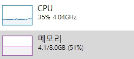
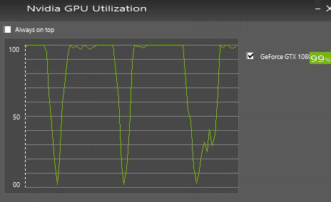
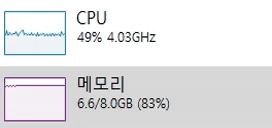
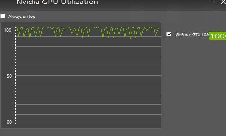

# Tensorflow_Training (Beginner vs Expert)

# Motive
- This is because you want faster results with the same hardware specification, model architecture and dataset.

# Experiments (Beginner vs Expert)

## # without Thread (Beginner) - Total Train Time : 1h 4m 25s

## # with Thread (Expert) - Total Train Time : 0h 50m 46s

# Conclusion
- Although both beginners and experts have the same test accuracy, the learning time has been reduced by 21% (if your original learning time is 30 days, you can save a week of learning time), but we used 2.5GB of RAM and 14% more CPU. Therefore, if you can afford the hardware, use Thread to save time.

# Harware Specification
- CPU : Intel(R) Core(TM) i7-7700 CPU @ 3.60GHz
- RAM : 8GB
- GPU : NVIDIA GeForce GTX 1080 Ti

# Requirements
- Python 3.5.2
- Tensorflow 1.13.1
- OpenCV 4.0.0
- Numpy 1.16.4

# Reference
- Idea : https://www.tensorflow.org/guide/performance/datasets
- Dataset : http://download.tensorflow.org/example_images/flower_photos.tgz
- Base Code : https://github.com/OFRIN/Tensorflow_Learning_Deep_Features_for_Discriminative_Localization

